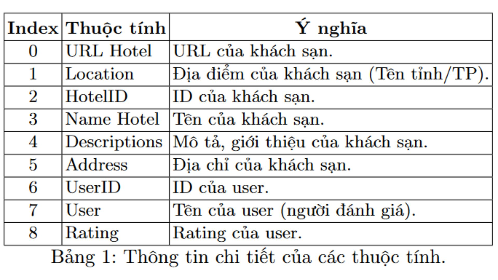
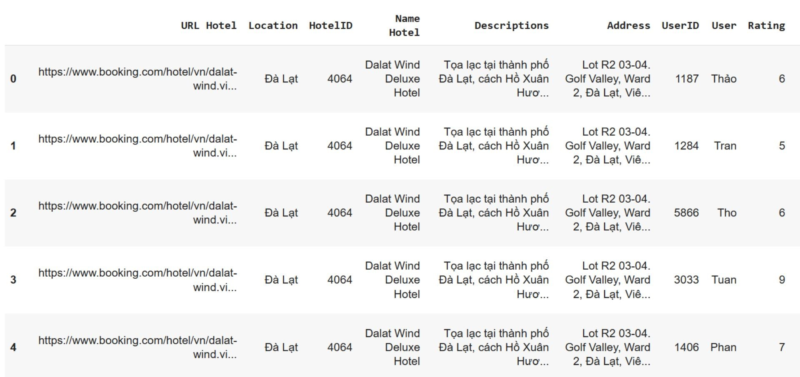

# <p align="center">Hotel-Recommendation-System</p>
#### Members:  
Nguyễn Phước Thắng - ThangNP1101  
Nguyễn Ngô Thành Đạt - Sonny-Inkai  
#### Demo:  
Please reach this link to see the demo: [Link Demo](repo_img/icons8-youtube-48.png)](https://www.youtube.com/watch?v=eyEq0Ukkv2Y)  
## Introduction  
### 1. Methods  
- In this research, we develop a hotel recommendation system using a ***hybrid approach***. We combine ***Content-based filtering*** and ***Collaborative filtering*** to improve recommendation accuracy.
- To address challenges like the cold start problem and sparse matrices, we implement a ***Graph-based Hybrid Recommendation System (GHRS)***.
- We use the ***GLocal-K (Global and Local Kernels)*** method to compare and evaluate system performance.
### 2. Dataset  
#### 1. Data collection 
- The dataset used in this study is the **Hotel Booking Rating Dataset**, scraped from Booking.com and available on Kaggle. It contains **38,801 rows** with **9 columns**, covering **4,506 hotels** across **10 provinces/cities**, and **6,471 users**. [Link Dataset](https://www.kaggle.com/datasets/phamtheds/hotel-booking-rating-dataset).
 
#### 2. Data processing 
Clean data is crucial for building accurate and generalizable forecasting models. In our study, we encountered sparse data, where many users provided few reviews, complicating the evaluation of recommendation systems. To optimize our dataset for a Collaborative filtering approach, we processed the data to create suitable training and testing sets.  
- We filtered for users with **30 or more ratings**, resulting in **139 users**.
- After that, we create a new dataset by selecting rows corresponding to these users, ensuring each user had **5 hotels rated** for testing.
- The remaining data from the Booking Hotels Dataset formed the training set.
- Consequently, our final datasets consisted of **695 rows** for testing and **38,066 rows** for training.
#### 3. Data sample

## Graph Hybrid User Context (GHUC)  
### Why GHUC?
**Graph-based Hybrid User Context (GHUC)** is a novel method developed to enhance user clustering by utilizing information from hotel ratings instead of relying solely on user demographic data, which can be difficult to collect. GHUC builds a user vector embedding by leveraging the relationships between hotels that users have rated. It inherits techniques from the existing GHRS method, which combines **similarity graphs** and **user demographics**. In this approach, GHUC focuses on **clustering users** and **creating a robust user context**, ultimately improving the overall user modeling and recommendation system.  
### GHUC Architecture  
The overall structure of our proposed system **GHUC - Graph-based Hybrid User Context*** is presented in the following picture. The system architecture includes six main steps:  
1. We construct a **Similarity Graph** with users as nodes, connecting users who share more than 𝛼 percent of products with similar ratings. We extract various metrics from this graph for each user, such as PageRank, degree centrality, proximity centrality, betweenness centrality, load centrality, and the average degree of neighbors.
2. We integrate **User Context** with the **Similarity Graph**, creating a combined matrix of different feature types for input into the Autoencoder stage.
3. The **Autoencoder** is applied to extract new features and reduce dimensionality.
4. We use the features encoded by the **Autoencoder** to cluster users with the **K-means** algorithm, forming several groups.
5. After clustering, we calculate hotel ratings by averaging ratings among users within each cluster and updating ratings for users who have not rated those hotels.
6.  To address missing ratings in clusters, we employ a Content-based filtering method, identifying the top k hotels similar to the one being processed and updating its rating based on the average rating of these hotels.  

## Method Description
- In our experiment, we utilize **GLocal-K** and **GHRS**, both of which excel in addressing **data sparsity** and the **cold start problem** in recommendation systems. To enhance the GHRS model, we integrate the Similarity Graph with User Demographic information, effectively tackling issues related to cold starts and sparse rating matrices.
- Additionally, we introduce the **GHUC (Graph Hybrid User Context)** model to address the challenge of **missing user information**, which aids in the development of new methodologies discussed in this section. Finally, we combine these traditional methods based on GLocal-K, specifically forming Ensemble GlocalK+GHUC and Ensemble GlocalK+GHRS to further improve recommendation accuracy.
## Summary  
In this project, we developed a new model for hotel recommendation systems based on a **Graph-based Recommendation System** method integrated with **User Context**. We also introduced several combined methods to enhance performance. Our results suggest that the **Graph-based User Context** approach can be effectively applied to hotel recommendation systems and further adapted for other recommendation contexts. Although we faced challenges due to the sparse dataset, we successfully identified optimal solutions to address this issue.
```
If you found this helpful, kindly consider leaving a ⭐⭐⭐⭐⭐. 
Thanks for your attention!
```

